# 🍽️ CookClever

CookClever is a full-stack MERN application that helps users discover delicious recipes, generate meals based on available ingredients, and build smart grocery lists — all from an intuitive, dashboard-style interface.

“Cook smart. Eat clever.”

---

## 🚀 Features

### 🧑‍🍳 User Experience
- 🔐 User Authentication (JWT)
- 🏠 Dashboard with random recipe inspiration
- 🥗 Ingredient-based recipe generator
- ❤️ Save & rate favorite recipes
- 🛒 Smart grocery list generation
- 🌙 Dark mode toggle
- 📱 Mobile-first responsive design

### 🧠 Technical Stack
- **Frontend**: React + Vite + TailwindCSS + shadcn/ui
- **Backend**: Node.js + Express + MongoDB
- **API Integration**: [Spoonacular API](https://spoonacular.com/food-api)
- **Auth**: JWT + bcrypt
- **State Management**: React Context (for Auth, Theme)

## Login and Register
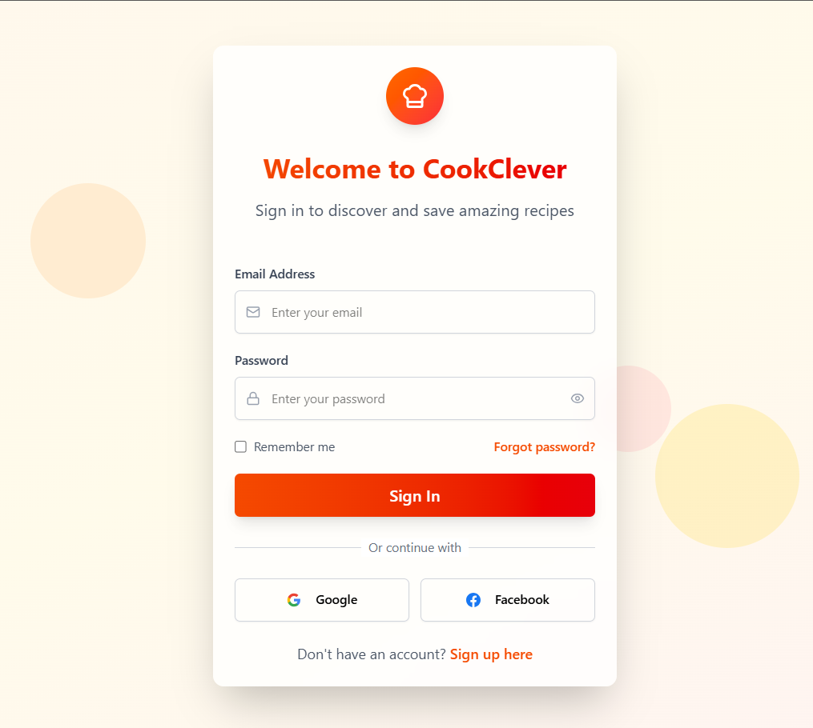 


## Home Screen
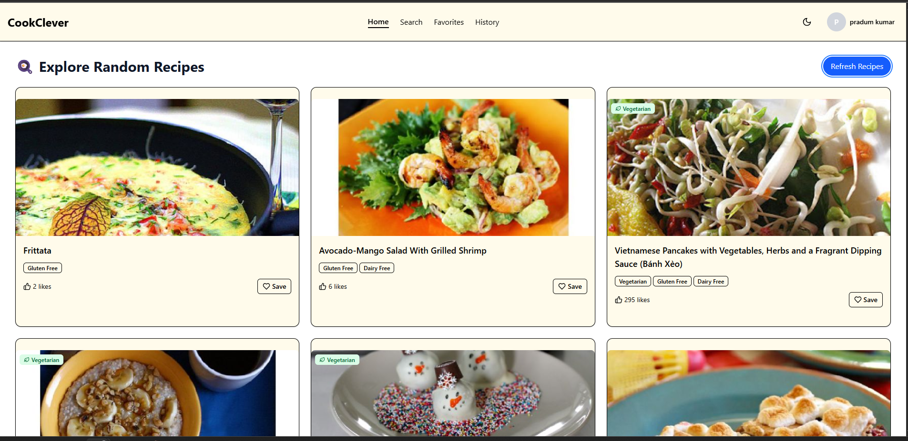

## Explore Recipe
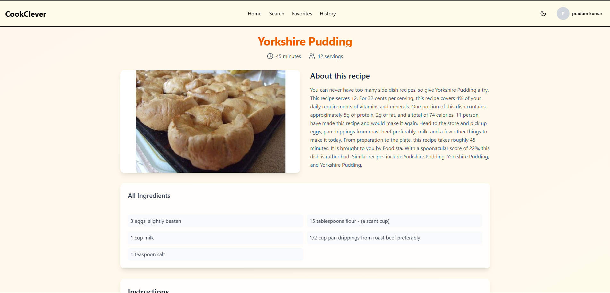

## Search By Ingrideints
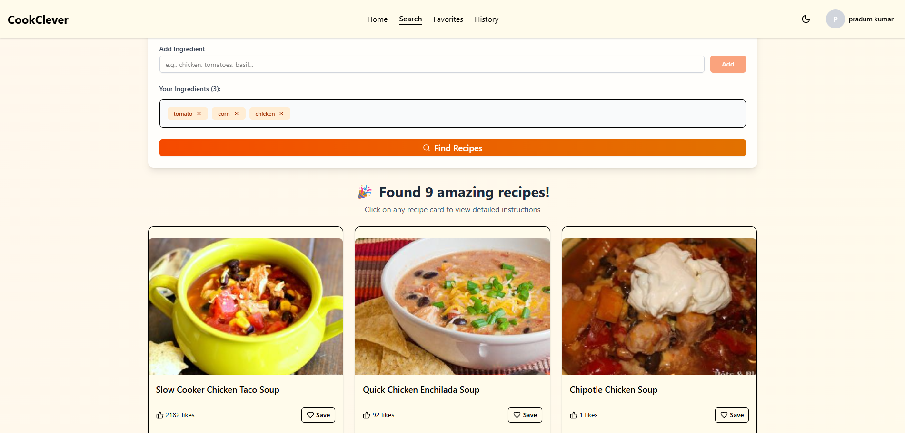

## Save Your recipes in Favorites
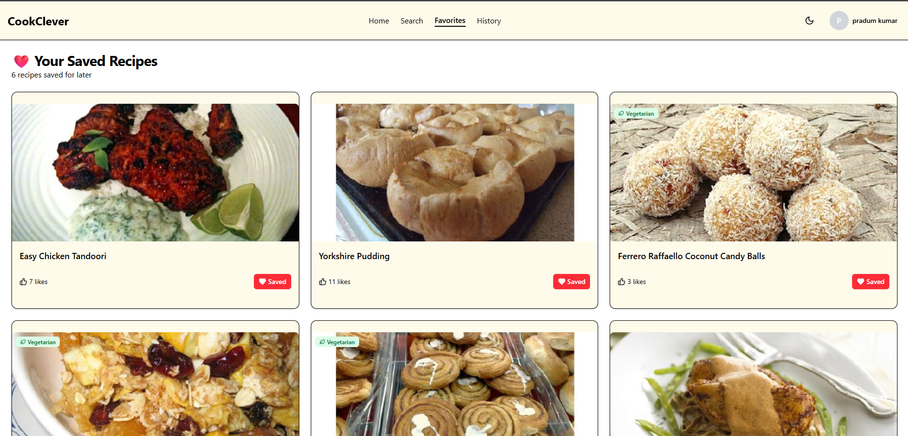

## Get Clear instruction on each Recipe
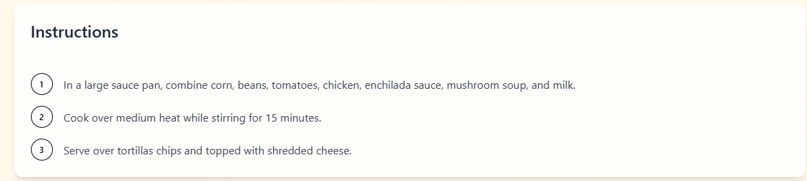

## Get your shooping list ready with Missing Ingredients
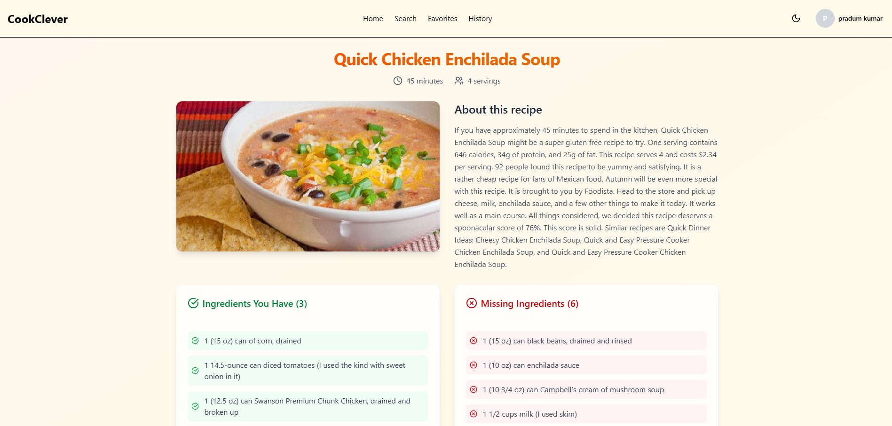

## Installation

1. **Clone the Repository**

```bash
git clone https://github.com/Pradum-codes/CookClever.git
cd CookClever
```

2. **Install Backend Dependencies**

```bash
cd server
npm install
```
3. **Set Environment Variables**
Create a .env file in the server/ directory:

### On Server
```env
PORT=3000
MONGO_URI=mongodb+srv://<mongo_username>:<db_password>@cluster0.3bermni.mongodb.net
MONGO_DB=CleverCook
JWT_SECRET=yourSecretKey
SPOONACULAR_API_KEY=yourApiKey
```

### On Client
```env
VITE_SERVER=SERVER_URL
```

4. **Run Backend**

```bash
npm start
```

5. **Install Frontend Dependencies**

```bash
cd ../client
npm install
```

6. **Run Frontend**

```bash
npm start
```

## API Overview

### Auth Routes
- POST /api/auth/register – Register new user
- POST /api/auth/login – Login and receive JWT

### Recipe Routes
- GET /api/recipes/api/recipes/random – Get Random recipes
- GET /api/recipes/:id – Get full recipe info by ID
- POST /api/recipes/save – Save a recipe
- POST /api/recipes/favorites – Fetch user's saved recipes
- POST /api/recipes/search - Fetch Recipes based on Ingredients

## Respective Screenshots of the Routes

### Register and Login
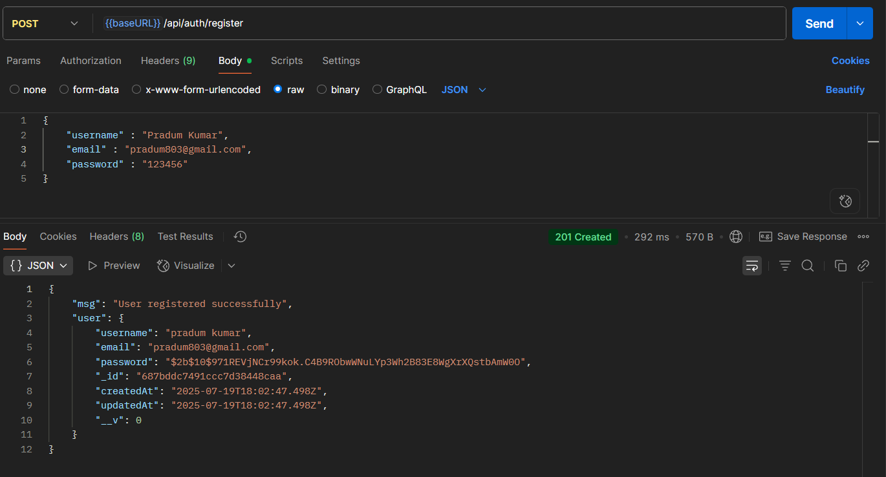
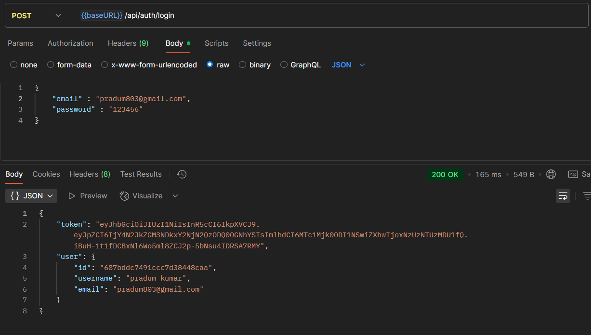

### Random Recipe
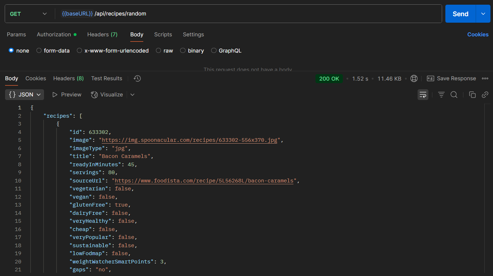

### Full Recipe
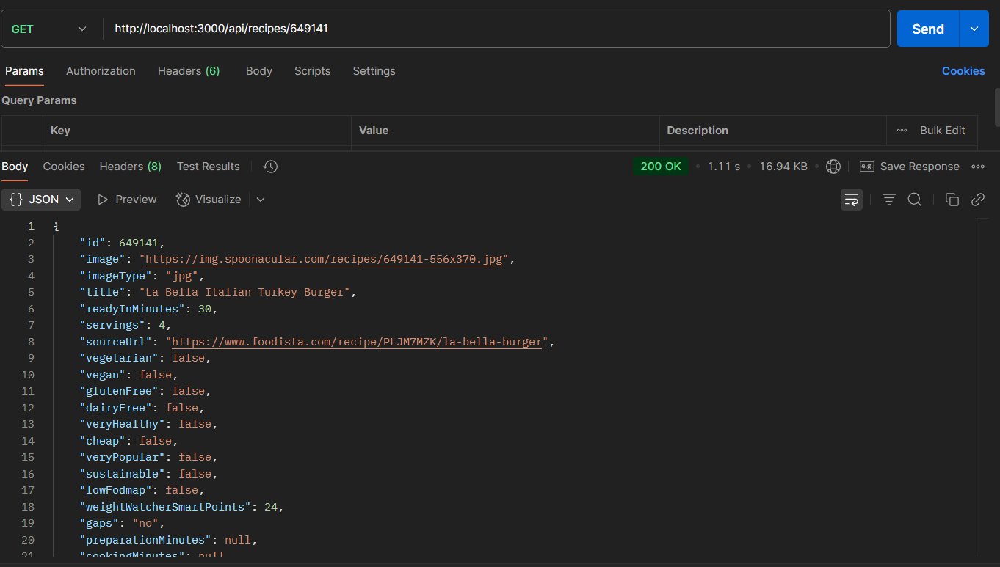

### Save Recipe
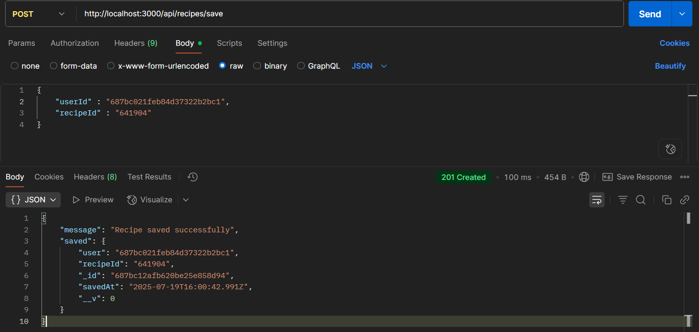

### Favorite Recipe
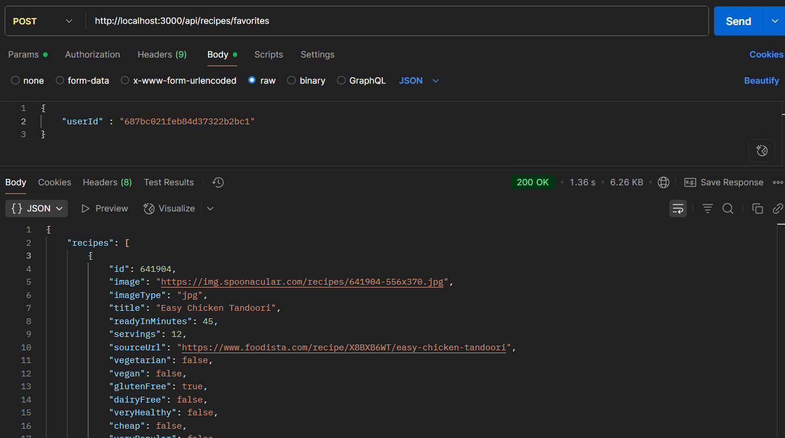

### Search Recipe

